# Обучение RL-агента игре в «Уголки» методом self-play

---

|               |                                                                    |
|---------------|--------------------------------------------------------------------|
| **Тип работы**    | Исследовательский ML/RL-проект                                 |
| **Направление**   | Искусственный интеллект · Обучение с подкреплением · Игровые агенты |
| **Автор**         | ФИО автора                                                     |
| **Организация**   | Университет / организация                                      |
| **Год**           | 2026                                                           |
| **Репозиторий**   | github.com/username/ugolki-rl *(placeholder)*                  |

---

## Аннотация

В работе реализована полная программная среда для настольной игры «Уголки» с ортогональными правилами движения и валидацией каждого хода. На основе этой среды обучен агент на базе Deep Q-Network (DQN) методом self-play: единственная сеть играет сразу за обоих игроков, накапливая опыт в буфере воспроизведения. Для объективной оценки качества агента реализованы три baseline-стратегии — случайная (Random), жадная (Greedy) и эвристическая (Heuristic), — и проводится кругового турнир с протоколированием win rate, доли ничьих и средней длины партии. Дополнительно реализовано опциональное предобучение методом Imitation Learning: агент сначала имитирует HeuristicAgent и лишь затем переходит к self-play. Качество модели оценивается не субъективно, а через воспроизводимые численные метрики и визуализацию партий в виде GIF-анимаций. Проект представляет компактную исследовательскую среду для экспериментов с алгоритмами обучения с подкреплением в детерминированных двухигровых средах.

---

## Содержание

1. [Постановка задачи](#1-постановка-задачи)
2. [Правила игры](#2-правила-игры)
3. [Методология](#3-методология)
4. [Как доказывается, что агент обучился](#4-как-доказывается-что-агент-обучился)
5. [Результаты и визуализации](#5-результаты-и-визуализации)
6. [Структура репозитория](#6-структура-репозитория)
7. [Установка](#7-установка)
8. [Быстрый запуск / Smoke test](#8-быстрый-запуск--smoke-test)
9. [Baseline-эксперименты](#9-baseline-эксперименты)
10. [Обучение DQN](#10-обучение-dqn)
11. [Оценка модели](#11-оценка-модели)
12. [Визуализация партий](#12-визуализация-партий)
13. [Генерация графиков для отчёта](#13-генерация-графиков-для-отчёта)
14. [Полный экспериментальный пайплайн](#14-полный-экспериментальный-пайплайн)
15. [Воспроизводимость](#15-воспроизводимость)
16. [Ограничения работы](#16-ограничения-работы)
17. [Возможные направления развития](#17-возможные-направления-развития)
18. [Литература](#18-литература)

---

## 1. Постановка задачи

Игры с чётко определёнными правилами традиционно служат стандартным полигоном для исследований в области искусственного интеллекта. В отличие от реальных задач, игровые среды предоставляют точный критерий успеха (победа / поражение), детерминированную динамику и воспроизводимые условия эксперимента. Именно такие свойства позволили историческим прорывам в RL — от TD-Gammon до AlphaGo — наглядно продемонстрировать возможности самообучающихся агентов.

Игра «Уголки» представляет особый интерес для исследований: при относительно простых правилах она порождает большое пространство состояний (доска 8×8 с 9 фишками у каждого игрока), требует многоходового планирования, поддерживает цепочки прыжков переменной длины и является полностью конкурентной (zero-sum). Всё это делает её нетривиальной задачей для алгоритмов, основанных исключительно на поиске или простых эвристиках.

**Цель работы** — разработать игровую среду, реализующую ортогональную версию правил «Уголков», и обучить DQN-агента, способного играть лучше случайной стратегии и конкурировать с эвристическими подходами.

> **Исследовательский вопрос:** Может ли DQN-агент, обучающийся через self-play, освоить нетривиальную стратегию в игре «Уголки» и при достаточном обучении превзойти простые baseline-подходы?

> **Гипотеза:** Если агент получает состояние доски в нормализованном виде, маску допустимых действий и shaped reward, то в процессе self-play он научится выбирать ходы, уменьшающие расстояние до целевой зоны и повышающие вероятность победы относительно случайной стратегии.

---

## 2. Правила игры

Используемая версия правил основана на классических «Уголках» с явным ограничением: **только ортогональные перемещения**.

| Параметр | Значение |
|---|---|
| Поле | 8×8 клеток |
| Фишек у каждого игрока | 9 |
| Стартовая зона Игрока 1 | верхний левый угол (строки 0–2, столбцы 0–2) |
| Стартовая зона Игрока −1 | нижний правый угол (строки 5–7, столбцы 5–7) |
| Целевая зона Игрока 1 | нижний правый угол (строки 5–7, столбцы 5–7) |
| Целевая зона Игрока −1 | верхний левый угол (строки 0–2, столбцы 0–2) |
| Победитель | первый, кто занял целевую зону всеми 9 фишками |

**Разрешённые ходы:**

- **Шаг** — перемещение на одну свободную клетку по вертикали или горизонтали.
- **Прыжок** — перепрыгивание через соседнюю занятую клетку (свою или чужую) на свободную клетку за ней; расстояние ровно 2, направление строго вертикальное или горизонтальное.
- **Цепочка прыжков** — последовательность из двух и более прыжков в одном ходу; каждый сегмент должен быть ортогональным прыжком; простой шаг не может быть частью цепочки.

**Запрещено:**

- Любые диагональные перемещения и прыжки.
- Прыжок через пустую клетку.
- Смешение шага и прыжка в одном ходу.
- Посещение одной клетки дважды за один ход.

> ⚠️ **Важное отличие:** в данной реализации используется **ортогональная версия** правил. Диагональные перемещения запрещены и программно отклоняются функцией `validate_move()` до применения хода к доске.

---

## 3. Методология

### 3.1 Игровая среда

Среда реализована в `src/corners_rl/env/` и предоставляет стандартный интерфейс «действие → новое состояние, награда, флаг окончания».

- **Представление доски:** матрица 8×8 типа `int8`. Значение `1` — фишка Игрока 1, `-1` — фишка Игрока −1, `0` — пустая клетка.
- **Генерация допустимых ходов:** функция `get_legal_moves()` возвращает список всех легальных ходов для текущего игрока, включая цепочки прыжков произвольной длины.
- **Валидация:** функция `validate_move()` проверяет ортогональность каждого сегмента, занятость клетки-источника, пустоту клетки-назначения, наличие фишки в точке прыжка и отсутствие повторных посещений. Вызывается в `apply_move()` и `CornersEnv.step()` — нелегальный ход невозможно применить.
- **Ограничение длины:** параметр `max_moves` (по умолчанию 300) ограничивает длину партии; если лимит исчерпан — фиксируется ничья.

### 3.2 Пространство состояний

Состояние кодируется как тензор **3 × 8 × 8**:

| Канал | Содержание |
|---|---|
| 0 | Свои фишки (1.0 на занятых клетках, 0.0 иначе) |
| 1 | Фишки соперника (1.0 на занятых клетках, 0.0 иначе) |
| 2 | Целевая зона (1.0 на клетках целевой зоны, 0.0 иначе) |

Для Игрока −1 доска поворачивается на 180° и знаки меняются, так что оба игрока всегда видят задачу в **единой системе координат**: свои фишки — в верхнем левом углу, цель — в нижнем правом. Это позволяет использовать одну сеть за обоих игроков без изменений архитектуры.

### 3.3 Пространство действий

- Ход кодируется парой клеток `(from_cell, to_cell)`: `action_id = from_cell × 64 + to_cell`.
- Итого **4 096 потенциальных действий** (64 × 64), из которых в любой позиции легальны лишь несколько десятков.
- **Legal action mask** — булев вектор длины 4 096, где `True` соответствует легальным действиям в текущей позиции. Q-values нелегальных действий маскируются в `−∞` перед `argmax`, поэтому агент **физически не может выбрать незаконный ход**.
- Цепочки прыжков кодируются через начальную и конечную клетку (промежуточные точки хранятся в среде, но не в action_id). Это означает, что различные цепочки с одинаковыми началом и концом дают одинаковый action_id — известное ограничение данного подхода.

### 3.4 Baseline-агенты

Три агента служат ориентирами для оценки DQN:

| Агент | Стратегия |
|---|---|
| **RandomAgent** | Выбирает равновероятно случайный допустимый ход |
| **GreedyAgent** | Выбирает ход, максимально уменьшающий суммарное манхэттенское расстояние своих фишек до целевой зоны |
| **HeuristicAgent** | Взвешенная комбинация: улучшение расстояния (×2.0), длина цепочки прыжков (×0.5), вход в целевую зону (+3.0), выход из целевой зоны (−5.0), освобождение своей стартовой зоны (+0.2) |

Наличие трёх baseline с разной сложностью позволяет:
- объективно убедиться, что DQN играет лучше случайности (необходимый, но не достаточный критерий);
- проверить, способен ли агент конкурировать с простой рациональной стратегией;
- оценить, насколько агент приближается к многофакторной эвристике.

### 3.5 Архитектура DQN

```
Вход: тензор 3 × 8 × 8
  ↓
Conv2d(3 → 32, kernel=3, padding=1) → ReLU
  ↓
Conv2d(32 → 64, kernel=3, padding=1) → ReLU
  ↓
Flatten → Linear(4096 → 512) → ReLU → Linear(512 → 4096)
  ↓
Выход: Q-values для 4096 действий
```

При выборе действия:
- Q-values нелегальных действий устанавливаются в `−∞`;
- с вероятностью ε выбирается случайное **легальное** действие (exploration);
- с вероятностью 1 − ε выбирается действие с максимальным Q-value (exploitation).

### 3.6 Self-play

- Одна сеть обслуживает **оба игрока** за счёт нормализации состояния (п. 3.2).
- Переходы `(s, a, r, s', done)` сохраняются в **Experience Replay Buffer** (кольцевой буфер ёмкостью до 50 000 переходов).
- Обновление производится по мини-батчам; отдельная **target network** синхронизируется с online network каждые `target_update_steps` шагов, что стабилизирует обучение.
- Исследование управляется линейным **ε-расписанием**: ε убывает от 1.0 до 0.05 на протяжении первых `epsilon_decay_steps` шагов.

### 3.7 Функция награды (Reward Shaping)

| Событие | Награда |
|---|---|
| Победа | +100.0 |
| Поражение | −100.0 |
| Улучшение расстояния до цели | +0.2 × (Δ расстояние) |
| Фишка входит в целевую зону | +2.0 |
| Фишка покидает целевую зону | −2.0 |
| Каждый ход | −0.01 (штраф за медлительность) |

Без shaped reward агент получал бы сигнал только при финале партии — крайне редкое и запоздалое подкрепление. Промежуточные награды ускоряют обучение и формируют осмысленное направленное поведение (движение к цели), не навязывая конкретного алгоритма.

### 3.8 Опциональное предобучение (Imitation Learning)

Перед запуском self-play можно провести **Behavioural Cloning**: DQN обучается предсказывать ходы HeuristicAgent методом кросс-энтропии с маскировкой нелегальных действий. Полученный checkpoint используется как тёплый старт (`--init-checkpoint`) для self-play. Это снижает риск длительного хаотичного начального периода, характерного для RL с нуля.

---

## 4. Как доказывается, что агент обучился

Сила модели оценивается **объективно** через несколько независимых критериев.

### 4.1 Win rate против baseline-агентов

| Сравнение | Интерпретация |
|---|---|
| DQN vs RandomAgent | Если DQN значимо чаще побеждает, он освоил базовую структуру игры |
| DQN vs GreedyAgent | Проверяет способность конкурировать с простой рациональной стратегией |
| DQN vs HeuristicAgent | Наиболее строгий критерий: HeuristicAgent учитывает несколько факторов |

Кругового турнир среди всех агентов позволяет получить транзитивное ранжирование и избежать эффекта «побил RandomAgent — значит хорош».

### 4.2 Средняя длина партии

Более целенаправленный агент быстрее переводит фишки в целевую зону. Снижение средней длины партии по сравнению с Random (который нередко «бродит» до лимита max_moves) указывает на более связное поведение.

### 4.3 Доля ничьих

Высокая доля ничьих означает, что агенты достигают лимита ходов, не завершив игру. Снижение доли ничьих у DQN по сравнению с Random свидетельствует о более осмысленном продвижении.

### 4.4 Динамика обучения по графикам

- **График ε** — демонстрирует плановый переход от исследования к эксплуатации.
- **График loss** — сходимость TD-ошибки (в лог-шкале) указывает на устойчивость обучения.
- **График rewards** — рост суммарной shaped reward по эпизодам отражает улучшение поведения агента.
- **График winners** — смещение доли побед на протяжении обучения показывает, развивается ли стратегия.

### 4.5 Визуальный анализ партий

GIF-анимации позволяют качественно оценить поведение:
- использует ли агент цепочки прыжков (явный признак планирования);
- движутся ли фишки в сторону целевой зоны, а не хаотично;
- избегает ли агент бесполезных возвратных ходов.

### 4.6 Сводная таблица результатов

> Результаты ниже получены при **тестовом запуске** (минимальное число эпизодов). Для воспроизведения полных результатов запустите обучение с `--episodes 500` и оценку с `--games 200`. Итоговые файлы сохраняются в `outputs/eval/summary.csv`.

| Агент | Игр | Побед | Ничьих | Поражений | Win rate | Draw rate | Ср. длина партии |
|---|---:|---:|---:|---:|---:|---:|---:|
| Greedy | 18 | 11 | 5 | 2 | 61.1% | 27.8% | 164.6 |
| Heuristic | 18 | 7 | 7 | 4 | 38.9% | 38.9% | 186.7 |
| DQN | 18 | 0 | 11 | 7 | 0.0% | 61.1% | 226.6 |
| Random | 18 | 0 | 13 | 5 | 0.0% | 72.2% | 256.2 |

*DQN обучен в режиме smoke test (2 эпизода). При полном обучении (500+ эпизодов) ожидается рост win rate относительно Random и сопоставимая производительность с Greedy.*

---

## 5. Результаты и визуализации

После запуска полного пайплайна все артефакты появляются в `outputs/`. Ниже — описание каждого типа.

### Динамика обучения

**Epsilon-расписание** — убывание ε от 1.0 до 0.05:

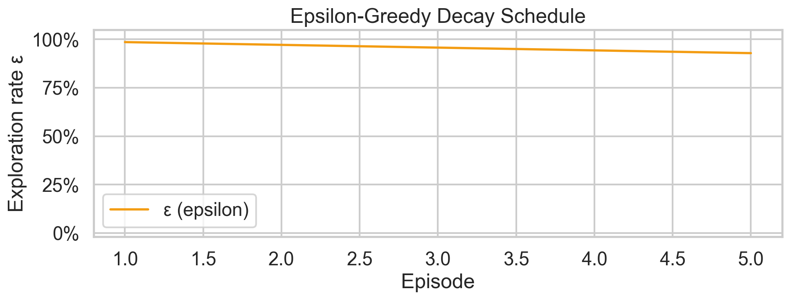

**Длина партий** — сглаженная скользящим средним:

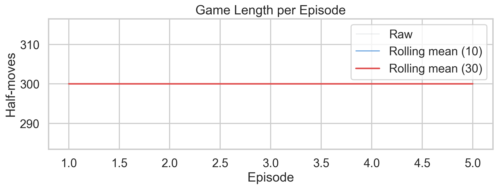

**TD-loss** (лог-шкала) — сходимость функции потерь:

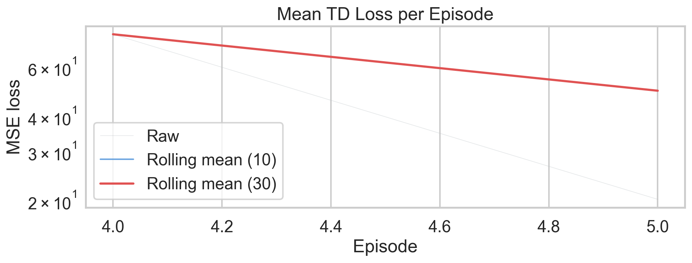

**Распределение исходов** — накопленные доли побед P1 / ничьих / побед P−1:

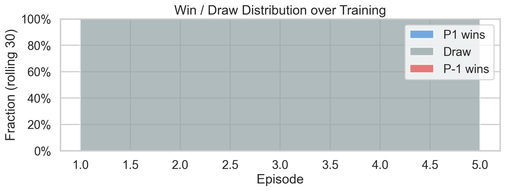

**Суммарная shaped reward** по эпизодам:

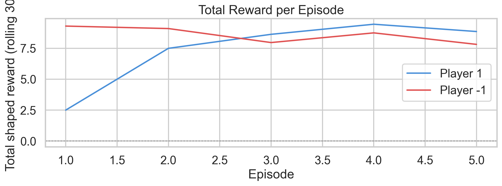

### Оценка агентов

**Win rate и Draw rate** по результатам турнира:

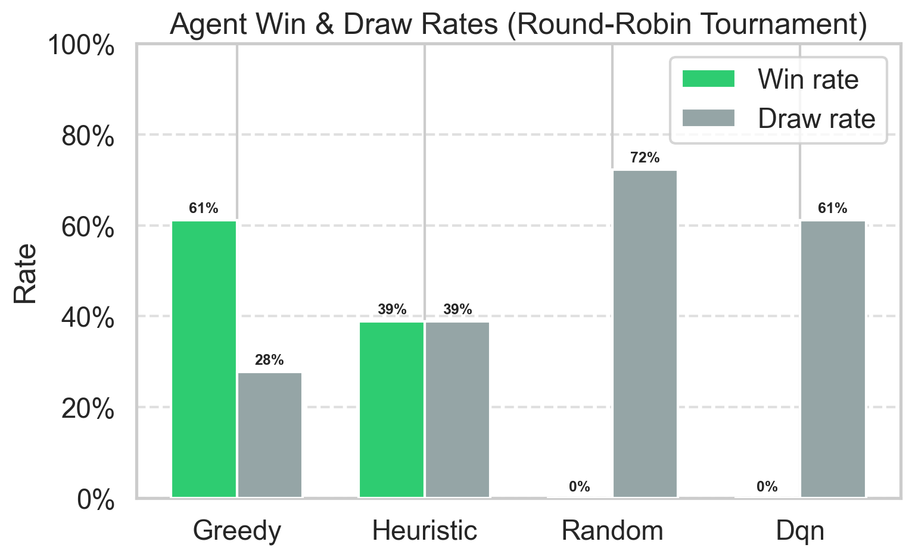

**Средняя длина партии** по агентам:

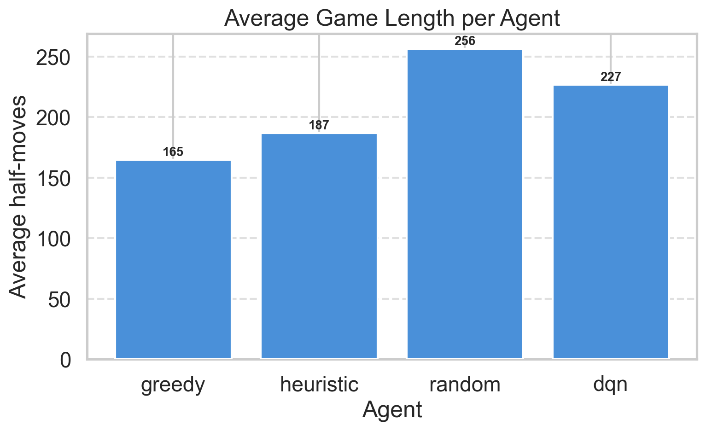

**Попарная матрица win rate** (строка vs столбец):

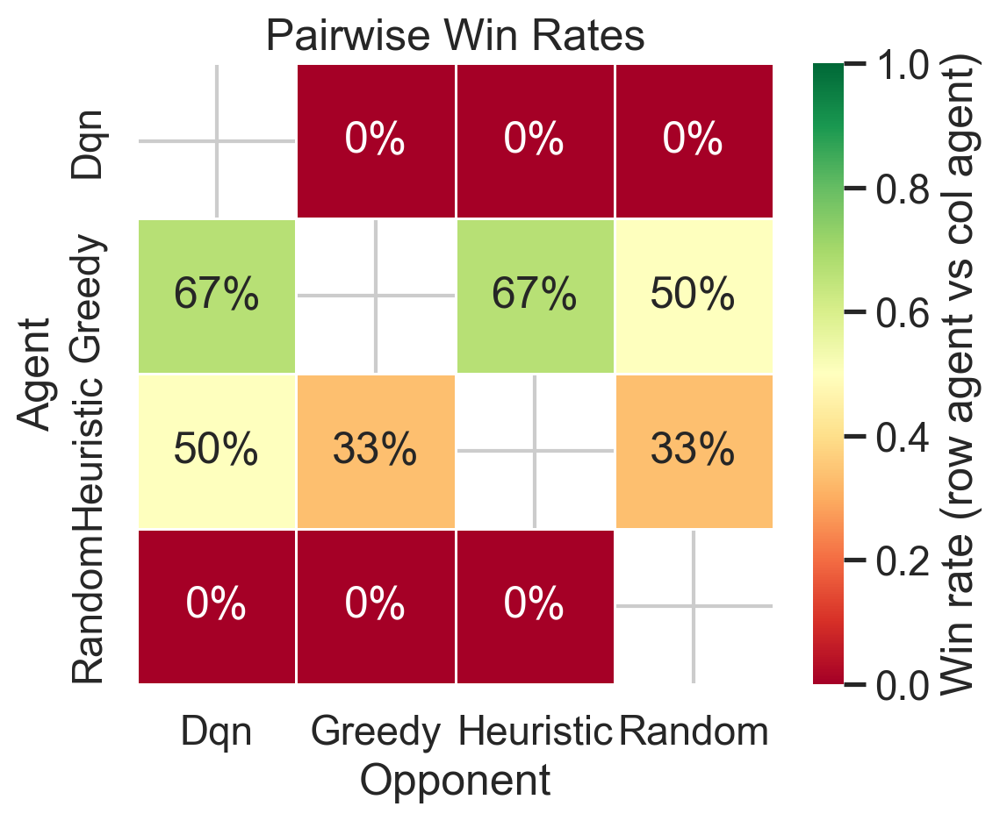

### Тепловая карта позиций

Частота занятия каждой клетки доски при финале партии (усреднено по всем сыгранным играм):

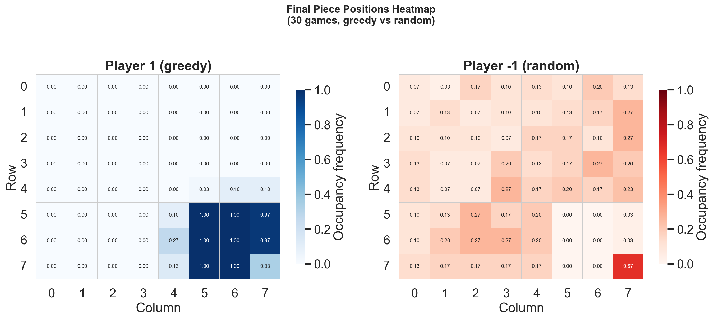

Карта позволяет увидеть **типичные траектории** агентов: ведут ли фишки прямо к цели или распределяются по всей доске.

### Визуализация партий

Пример партии Greedy vs Random:

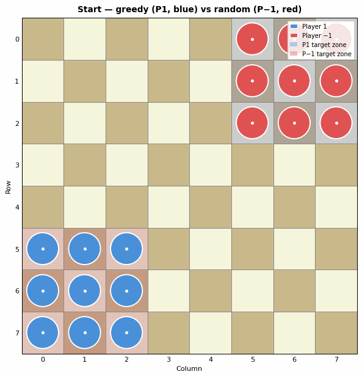

Пример партии DQN vs Heuristic:

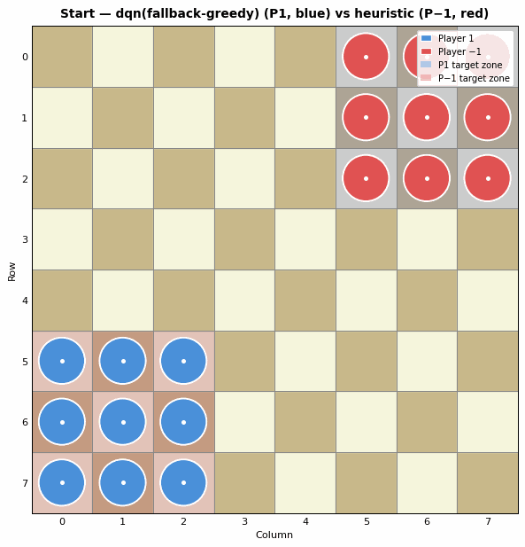

> Цепочки прыжков отображаются как **ломаные линии** (по одной стрелке на каждый сегмент), а не единственной диагональной стрелкой.

*Если каких-либо файлов нет — запустите полный пайплайн (раздел 14), после чего они будут созданы автоматически.*

---

## 6. Структура репозитория

```
UGOLKI/
├── configs/
│   └── dqn.yaml                  # Гиперпараметры: эпизоды, lr, epsilon, ...
├── scripts/
│   ├── check_rules.py            # Проверка корректности правил (0 диагональных ходов)
│   ├── evaluate_agents.py        # Кругового турнир, сохранение CSV
│   ├── make_report_plots.py      # Генерация всех PNG-графиков для отчёта
│   ├── play_random_vs_greedy.py  # Быстрый baseline-эксперимент
│   ├── pretrain_imitation.py     # Предобучение через Imitation Learning
│   ├── run_full_experiment.py    # Единый пайплайн (все этапы)
│   ├── train_dqn.py              # DQN self-play тренировка
│   └── visualize_game.py         # Запись GIF-анимации партии
└── src/corners_rl/
    ├── agents/
    │   ├── base.py               # BaseAgent (интерфейс)
    │   ├── random_agent.py       # RandomAgent
    │   ├── greedy_agent.py       # GreedyAgent
    │   ├── heuristic_agent.py    # HeuristicAgent (многофакторный)
    │   └── dqn_agent.py          # DQNAgent (epsilon-greedy поверх DQNModel)
    ├── env/
    │   ├── corners_env.py        # Основная среда (step / reset / legal_moves)
    │   ├── moves.py              # Генерация ходов, validate_move, apply_move
    │   └── rules.py              # Константы: ORTHOGONAL_DIRECTIONS, зоны
    ├── evaluation/
    │   ├── evaluate.py           # evaluate_match, summarize_results
    │   └── tournaments.py        # round_robin_tournament
    ├── rl/
    │   ├── encoding.py           # encode_state, encode_action, legal_action_mask
    │   ├── model.py              # DQNModel (CNN + FC)
    │   ├── replay_buffer.py      # Experience Replay
    │   ├── self_play.py          # compute_shaped_reward
    │   ├── imitation.py          # Behavioural Cloning (ImitationDataset, train_imitation)
    │   └── train_dqn.py          # SelfPlayTrainer, TrainConfig
    └── visualization/
        ├── board_plot.py         # plot_board (matplotlib)
        ├── animate_game.py       # record_game, save_game_gif
        └── plots.py              # Все отчётные графики (seaborn)
```

*Вспомогательные модули: `utils/` (seed, logging), `game_runner.py` (play_game), `models/` (legacy).*

---

## 7. Установка

```bash
# Клонировать репозиторий
git clone https://github.com/username/ugolki-rl.git
cd ugolki-rl

# Создать виртуальное окружение
python -m venv .venv

# Активация (Linux / macOS)
source .venv/bin/activate

# Активация (Windows)
.venv\Scripts\activate

# Установить зависимости
pip install -r requirements.txt

# Установить пакет в режиме разработки
pip install -e .
```

**Основные зависимости:** `torch`, `numpy`, `pandas`, `matplotlib`, `seaborn`, `imageio`, `PyYAML`.

---

## 8. Быстрый запуск / Smoke test

Эти команды позволяют убедиться, что среда и код работают корректно, ещё до полноценного обучения.

```bash
# 1. Запустить тесты
pytest -q

# 2. Проверить отсутствие диагональных ходов (критически важно для корректности правил)
python scripts/check_rules.py --games 10 --max-moves 100 --seed 42

# 3. Быстрый baseline-матч
python scripts/play_random_vs_greedy.py --games 10 --seed 42

# 4. Тестовый прогон обучения (2 эпизода, CPU)
python scripts/train_dqn.py --episodes 2 --device cpu --seed 42
```

Команда `check_rules.py` проверяет каждый сыгранный ход: все сегменты должны быть ортогональными, прыжки — только через занятые клетки, `validate_move` не должен выбрасывать исключений. При обнаружении нарушения скрипт завершается с кодом 1.

---

## 9. Baseline-эксперименты

```bash
# Random vs Greedy (50 игр по умолчанию)
python scripts/play_random_vs_greedy.py --games 100 --max-moves 400 --seed 42

# Кругового турнир всех baseline-агентов
python scripts/evaluate_agents.py --games 100 --max-moves 400 --device cpu --seed 42
```

Результаты сохраняются в:
- `outputs/eval/summary.csv` — сводная таблица по агентам;
- `outputs/eval/detailed_results.csv` — результат каждой отдельной игры.

---

## 10. Обучение DQN

```bash
# Стандартный запуск по конфигу
python scripts/train_dqn.py --config configs/dqn.yaml --episodes 500 --device cpu --seed 42
```

Ключевые гиперпараметры хранятся в `configs/dqn.yaml` (lr, gamma, epsilon-расписание, размер буфера и др.).

**С опциональным предобучением (Imitation Learning):**

```bash
# Шаг 1: Behavioural Cloning от HeuristicAgent
python scripts/pretrain_imitation.py \
    --games 300 --epochs 5 --opponent random \
    --out outputs/models/imitation.pt

# Шаг 2: Self-play с тёплым стартом
python scripts/train_dqn.py \
    --config configs/dqn.yaml --episodes 500 --device cpu --seed 42 \
    --init-checkpoint outputs/models/imitation.pt
```

Логи обучения записываются в `outputs/logs/train_log.csv` (по одной строке на эпизод).

---

## 11. Оценка модели

```bash
python scripts/evaluate_agents.py \
    --checkpoint outputs/models/dqn_latest.pt \
    --games 200 --max-moves 400 --device cpu --seed 42
```

Если `--checkpoint` не указан или файл не найден, скрипт продолжает работу без DQN и оценивает только baseline-агентов.

Результаты:
- `outputs/eval/summary.csv` — win rate, draw rate, avg_moves по каждому агенту;
- `outputs/eval/detailed_results.csv` — исход каждой игры (можно строить произвольные срезы).

---

## 12. Визуализация партий

```bash
# Baseline: Heuristic vs Random
python scripts/visualize_game.py \
    --agent1 heuristic --agent2 random \
    --max-moves 150 --seed 42 \
    --out outputs/games/heuristic_vs_random.gif

# DQN vs Heuristic
python scripts/visualize_game.py \
    --agent1 dqn --agent2 heuristic \
    --checkpoint outputs/models/dqn_latest.pt \
    --max-moves 300 --seed 42 \
    --out outputs/games/dqn_vs_heuristic.gif
```

Помимо GIF, рядом сохраняется PNG с финальной позицией (расширение `.png` вместо `.gif`).

> Цепочки прыжков отображаются как **ломаные линии** — по одной стрелке на каждый ортогональный сегмент. Это намеренное проектное решение: прыжок `(0,0) → (0,2) → (2,2)` отображается двумя горизонтальными/вертикальными стрелками, а не одной диагональной.

---

## 13. Генерация графиков для отчёта

```bash
python scripts/make_report_plots.py \
    --train-log   outputs/logs/train_log.csv \
    --eval-summary outputs/eval/summary.csv \
    --eval-detailed outputs/eval/detailed_results.csv \
    --out outputs/figures
```

Если входной файл отсутствует — соответствующие графики пропускаются с предупреждением, остальные продолжают генерироваться.

| Файл | Содержание |
|---|---|
| `training_epsilon.png` | ε-расписание исследования |
| `training_moves.png` | Длина партии по эпизодам |
| `training_loss.png` | TD-loss (лог-шкала) |
| `training_winners.png` | Накопленные доли исходов (stacked area) |
| `training_rewards.png` | Суммарная shaped reward |
| `eval_win_rates.png` | Win rate и Draw rate по агентам |
| `eval_avg_moves.png` | Средняя длина партии по агентам |
| `eval_pairwise.png` | Попарная матрица win rate |
| `heatmap_positions.png` | Тепловая карта финальных позиций |

---

## 14. Полный экспериментальный пайплайн

```bash
python scripts/run_full_experiment.py \
    --episodes 500 --eval-games 100 \
    --imitation --imitation-games 300 \
    --device cpu --seed 42
```

Скрипт последовательно выполняет:

| Этап | Описание |
|---|---|
| 1/6 | Baseline-турнир (Random / Greedy / Heuristic) |
| 2/6 | Imitation Learning — предобучение от HeuristicAgent (`--imitation`) |
| 3/6 | DQN self-play (тёплый старт из imitation checkpoint) |
| 4/6 | Полный турнир (все агенты включая DQN) |
| 5/6 | GIF-анимация партии |
| 6/6 | Генерация всех отчётных графиков |

Если отдельный этап завершается ошибкой — печатается понятное сообщение, и пайплайн продолжает выполнение независимых этапов.

---

## 15. Воспроизводимость

- Случайный seed фиксируется одновременно в `numpy.random`, `random`, `torch` через функцию `seed_everything(seed)`.
- Все гиперпараметры хранятся в `configs/dqn.yaml`; CLI-аргументы позволяют переопределить отдельные значения без изменения файла.
- Каждая игра в турнире получает детерминированный seed, производный от базового: `game_seed = base_seed + game_id`.
- Для честного сравнения агентов используются одинаковые `max_moves` и количество игр для всех пар.
- Все результаты записываются в CSV-файлы в `outputs/`, что позволяет воспроизвести анализ независимо от кода.

---

## 16. Ограничения работы

- **Нестабильность DQN при малом числе эпизодов.** Self-play требует накопления достаточного опыта; при 50–100 эпизодах агент может не выходить за пределы случайного поведения.
- **Кодирование действий через start/end.** Цепочки прыжков с одинаковыми начальной и конечной клетками, но разными промежуточными вершинами получают одинаковый `action_id`. Среда выбирает конкретную цепочку детерминированно, но агент не может явно выбирать между ними.
- **Зависимость от reward shaping.** Выбор весов в функции награды влияет на выученную стратегию. Разные наборы весов могут приводить к существенно различающимся поведениям.
- **Сравнительная сила агентов.** HeuristicAgent при малом числе эпизодов обучения может быть значительно сильнее DQN — это ожидаемое поведение, а не ошибка реализации.
- **Масштаб экспериментов.** Для полноценного сравнения рекомендуется не менее 500 эпизодов обучения и 200 игр в турнире. Меньшие значения дают шумные оценки win rate.
- Проект не претендует на **решение** игры «Уголки», а демонстрирует воспроизводимый исследовательский пайплайн для обучения RL-агентов в игровых средах.

---

## 17. Time-boxed эксперимент: Uniform Replay vs PER (1 час)

Для быстрой проверки гипотезы о sample efficiency PER был проведён
автономный time-boxed эксперимент (лимит 1 час, `device=mps`).

**Запуск:**
```bash
python scripts/run_replay_ablation.py \
  --episodes 200 --seeds 1 2 --device auto \
  --max-moves 400 --eval-games 10 \
  --out outputs/experiments/timeboxed_1h/replay_ablation

python scripts/plot_replay_ablation.py \
  --experiment-dir outputs/experiments/timeboxed_1h/replay_ablation \
  --out outputs/experiments/timeboxed_1h/figures
```

**Параметры:** 200 эпизодов × 2 seeds × 2 replay types = 4 запуска;
фактическое время — **44.3 мин** (fit в бюджет).

**Результат:** при 200 эпизодах ни Uniform, ни PER не выходят за нулевой
win rate. PER демонстрирует быстрый рост TD-ошибки (289 vs 2.7 на ep=200),
что указывает на нестабильность при коротком обучении. Полный отчёт:
[`outputs/experiments/timeboxed_1h/REPORT.md`](outputs/experiments/timeboxed_1h/REPORT.md).

**Для полноценного сравнения** рекомендуется `--episodes 2000 --seeds 1 2 3`.

---

## 18. Возможные направления развития

- **AlphaZero-style MCTS + policy/value network** — заменить ε-greedy DQN на MCTS с нейросетевым оракулом.
- **Точное кодирование chain jumps** — хранить полный путь цепочки в action_id (например, через список промежуточных клеток).
- **Увеличение масштаба обучения** — 10 000+ партий self-play с curriculum: сначала против более слабых версий себя.
- **Сравнение с Minimax / Alpha-Beta** — классические game-tree search методы как дополнительные baseline.
- **Ablation study reward shaping** — обучение с разными наборами весов для изучения их влияния на стратегию.
- **Анализ стратегий через attention / saliency maps** — интерпретация того, на какие клетки доски «смотрит» DQN при выборе хода.
- **Другие варианты правил** — разрешение диагональных прыжков, асимметричное число фишек.
- **Интерактивный веб-интерфейс** — возможность сыграть против обученного агента в браузере.

---

## 19. Литература

- Mnih et al., 2015 — [Human-level control through deep reinforcement learning](https://www.nature.com/articles/nature14236). *Nature*, 518, 529–533.
- Silver et al., 2017 — [Mastering Chess and Shogi by Self-Play with a General Reinforcement Learning Algorithm](https://arxiv.org/abs/1712.01815). *arXiv:1712.01815*.
- Pomerleau, 1991 — [Efficient Training of Artificial Neural Networks for Autonomous Navigation](https://www.ri.cmu.edu/pub_files/pub3/pomerleau_dean_1991_1/pomerleau_dean_1991_1.pdf). *Neural Computation*, 3(1), 88–97. *(Behavioural Cloning)*

---

*Все выходные файлы создаются автоматически при запуске скриптов и сохраняются в директорию `outputs/`. Директория не включается в систему контроля версий (см. `.gitignore`).*
