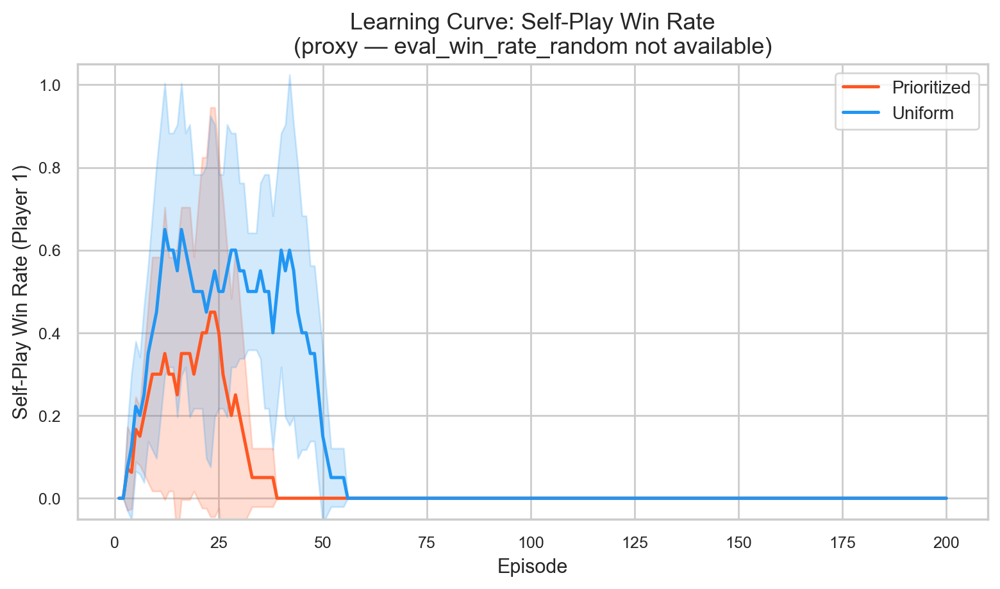
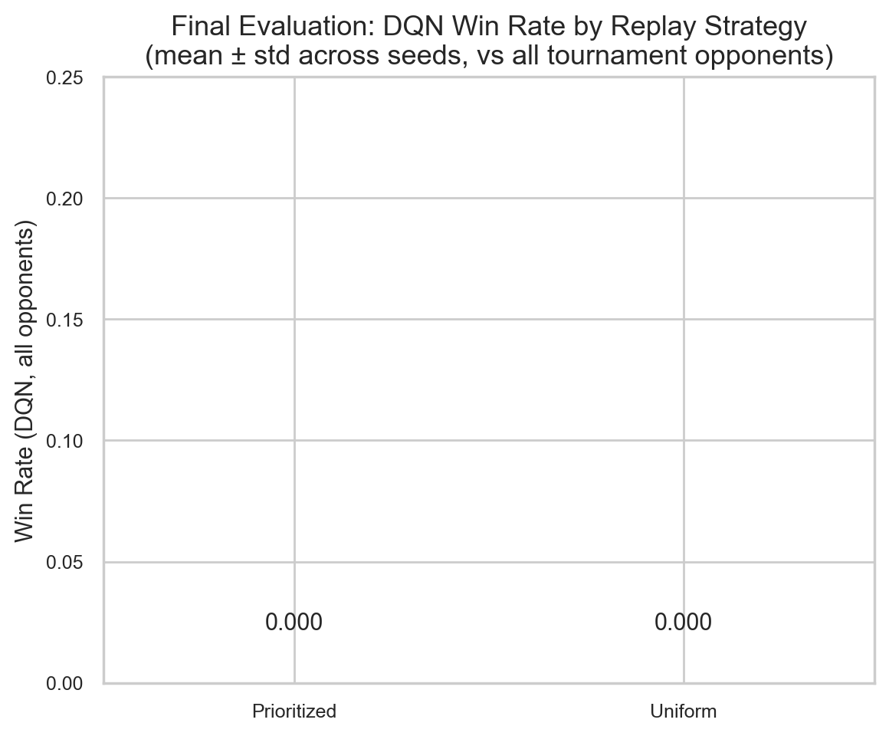
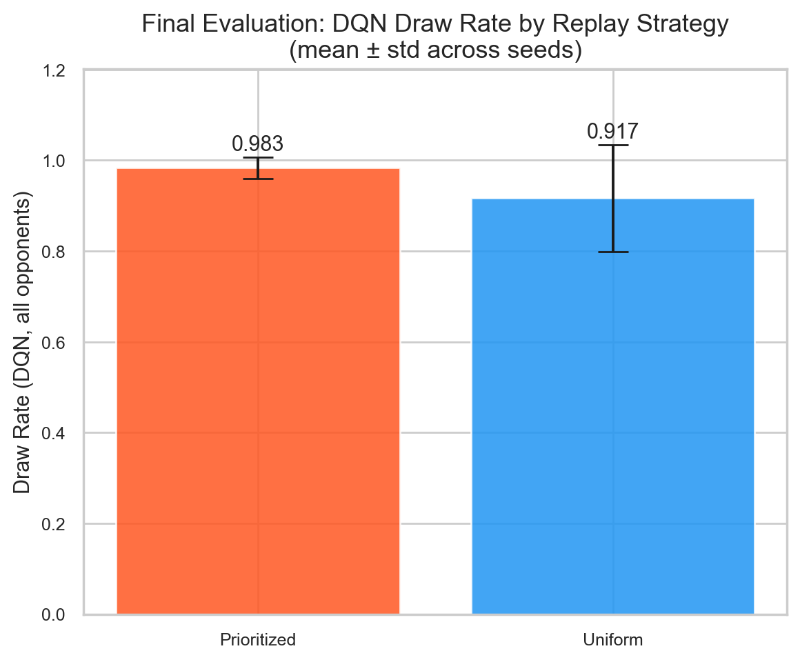
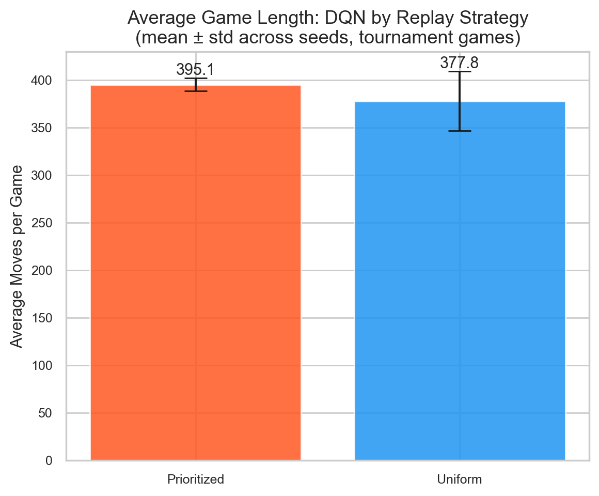
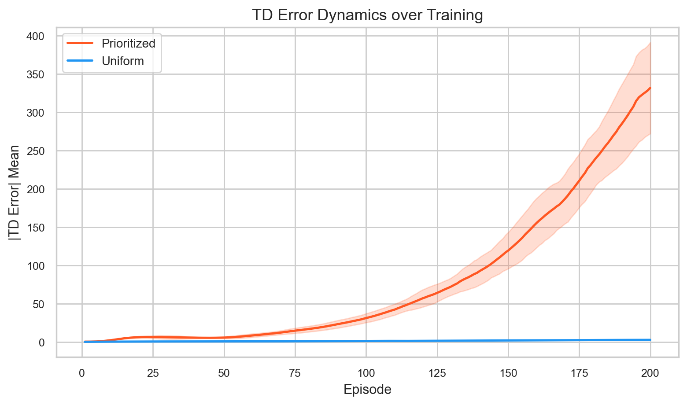
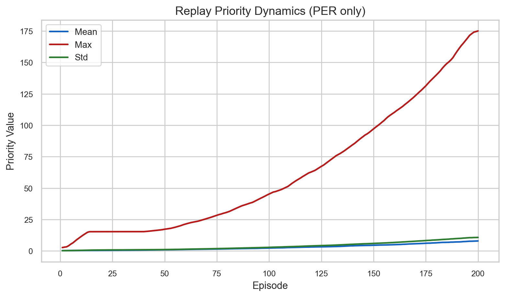
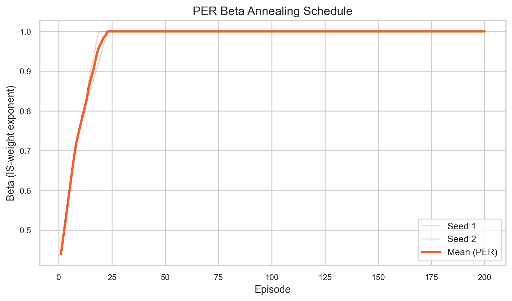

# Time-boxed эксперимент: Uniform Replay vs Prioritized Experience Replay

## Цель

Проверить гипотезу, что **Prioritized Experience Replay (PER)** повышает sample
efficiency DQN по сравнению с **Uniform Experience Replay** при одинаковых
условиях обучения в игре «Уголки» (8×8, ортогональные ходы/прыжки).

Метрики интереса:
- скорость сходимости (TD-ошибка, loss по эпизодам);
- итоговый win rate DQN против базовых агентов (Random, Greedy, Heuristic);
- доля ничьих и средняя длина партии.

---

## Условия эксперимента

| Параметр             | Значение                          |
|----------------------|-----------------------------------|
| Устройство           | Apple Silicon MPS (PyTorch 2.11)  |
| Лимит времени        | 1 час wall-clock                  |
| Replay types         | `uniform`, `prioritized`          |
| Episodes             | 200 (на запуск)                   |
| Seeds                | `[1, 2]`                          |
| Eval games per pair  | 10                                |
| Max moves per game   | 400                               |
| Batch size           | 64                                |
| Replay capacity      | 10 000                            |
| Train start size     | 64                                |
| Learning rate        | 0.0001                            |
| ε-decay steps        | 4 000                             |
| PER α                | 0.6                               |
| PER β (start→end)    | 0.4 → 1.0 (over 6 000 steps)     |
| Запусков всего       | 4 (2 seeds × 2 replay types)      |

---

## Benchmark

Перед экспериментом запущен benchmark на 20 эпизодов с `batch_size=32`,
`device=mps`, `max_moves=400`.

| Метрика                  | Значение    |
|--------------------------|-------------|
| Seconds per episode      | 3.449 s     |
| Avg moves per episode    | 320.6       |
| Estimated total (2s×200) | ~52 мин     |
| Actual total runtime     | **44.3 мин**|

Все 4 запуска завершились успешно.

---

## Статус запусков

| Replay type  | Seed | Status    | Runtime  |
|--------------|------|-----------|----------|
| uniform      | 1    | completed | 666.9 s  |
| uniform      | 2    | completed | 688.0 s  |
| prioritized  | 1    | completed | 660.0 s  |
| prioritized  | 2    | completed | 643.7 s  |

---

## Результаты

### Итоговый eval DQN (round-robin tournament против Random / Greedy / Heuristic)

| Replay type  | Win Rate (mean±std) | Draw Rate (mean±std) | Avg Moves (mean±std) |
|--------------|---------------------|----------------------|----------------------|
| Uniform      | 0.000 ± 0.000       | 0.917 ± 0.118        | 377.8 ± 31.4         |
| Prioritized  | 0.000 ± 0.000       | 0.983 ± 0.024        | 395.1 ± 7.0          |

> **Примечание:** DQN не выиграл ни одной партии при обоих стратегиях.
> Высокая доля ничьих (~90–100%) означает, что большинство игр достигало
> лимита в 400 ходов — агент не выработал стратегию завершения партии.

### TD-ошибка и loss (последние 20 эпизодов)

| Replay type  | |TD error| mean | Loss mean |
|--------------|-----------------|-----------|
| Uniform      | 2.73            | 2.29      |
| Prioritized  | 289.41          | 10.81     |

### PER-специфичные метрики (последний эпизод)

| Метрика             | Значение       |
|---------------------|----------------|
| per_beta (min→max)  | 0.44 → 1.00    |
| priority_mean (ep200)| 8.31          |
| priority_max (ep200)| 178.47         |

---

## Интерпретация

### Converged или нет?

Ни один из агентов не научился выигрывать за 200 эпизодов. Все партии в
финальном eval завершались вничью (лимит ходов). Это ожидаемо: задача
«Уголки» сложная (64 клетки, 12 фигур на сторону, длинный горизонт), и
200 эпизодов self-play — крайне короткое обучение.

### Есть ли признаки, что PER обучается быстрее?

Прямого признака sample efficiency у PER не выявлено, поскольку оба
агента остались на нулевом win rate. Тем не менее, можно отметить:

- **TD error (|δ|)** у PER резко растёт с каждым эпизодом
  (с ~4.8 на ep=40 до ~380 на ep=200), тогда как у Uniform
  рост умеренный (с ~0.7 до ~3.0).
- **Loss** у PER также выше (10.8 vs 2.3).
- **Draw rate** DQN с PER выше (0.983 vs 0.917), т.е. PER-агент
  реже проигрывает (не падает в ноль), но и не выигрывает.

Взрывной рост |δ| и loss при PER — типичный признак
**нестабильности обучения** при коротком горизонте:
PER агрессивно prioritizes transitions с высокой ошибкой,
ведущей к переобучению на «трудных» переходах без адекватного сигнала.

### Выигрывает ли PER у Uniform?

**Нет** — в данном эксперименте. Оба агента имеют win rate = 0.
Если брать draw rate как косвенный показатель (меньше поражений),
PER незначительно лучше (0.983 vs 0.917), но разница в пределах std.

### Достаточно ли данных для строгого вывода?

**Нет.** Основные ограничения:

1. **Слишком мало эпизодов** (200): сигнал обучения не успевает
   накопиться; агенты не выходят из режима рандомных действий
   (ε уже = 0.05, но стратегии не сформированы).
2. **Только 2 seeds**: стандартная ошибка ненадёжна.
3. **Eval без per-opponent breakdown**: tournament summary даёт
   агрегированный win rate по всем оппонентам, а не отдельно
   vs Random / vs Greedy / vs Heuristic.
4. **200 эпизодов для Uniform vs PER**: научная литература
   сравнивает стратегии на 10 000–100 000 эпизодов.

---

## Графики

### Динамика self-play win rate (P1) по эпизодам

> *Примечание: `eval_win_rate_random` отсутствует в логах (нет периодического eval
> во время обучения), поэтому показан proxy — сглаженный P1 self-play win rate.*



### Итоговый win rate DQN по replay-стратегии



### Draw rate по replay-стратегии



### Средняя длина партии



### Динамика TD-ошибки



### Динамика приоритетов (PER)



### Beta annealing schedule (PER)



---

## Итоговая таблица (summary)

| Replay Type   | Agent     | Win Rate      | Draw Rate     | Avg Moves        |
|:--------------|:----------|:--------------|:--------------|:-----------------|
| Prioritized   | dqn       | 0.000 ± 0.000 | 0.983 ± 0.024 | 395.1 ± 7.0      |
| Prioritized   | greedy    | 0.317 ± 0.024 | 0.567 ± 0.000 | 282.3 ± 0.2      |
| Prioritized   | heuristic | 0.300 ± 0.047 | 0.483 ± 0.024 | 257.5 ± 3.8      |
| Prioritized   | random    | 0.000 ± 0.000 | 0.733 ± 0.000 | 342.1 ± 1.8      |
| Uniform       | dqn       | 0.000 ± 0.000 | 0.917 ± 0.118 | 377.8 ± 31.4     |
| Uniform       | greedy    | 0.383 ± 0.071 | 0.500 ± 0.094 | 264.9 ± 24.3     |
| Uniform       | heuristic | 0.300 ± 0.047 | 0.483 ± 0.024 | 257.5 ± 3.8      |
| Uniform       | random    | 0.000 ± 0.000 | 0.733 ± 0.000 | 342.1 ± 1.8      |

---

## Вывод

В рамках 1-часового time-boxed эксперимента (200 эпизодов, 2 seeds,
device=mps) **устойчивого преимущества PER перед Uniform Replay
не выявлено**: оба агента не выигрывают ни одной партии
в финальном eval.

Характерная особенность: при PER наблюдается взрывной рост TD-ошибки
(289 vs 2.7 на последних эпизодах), что указывает на нестабильность
при коротком обучении.

**Эксперимент является предварительным и требует более длительного
запуска** (рекомендуется ≥ 2 000 эпизодов, ≥ 3 seeds) для
обоснованного сравнения. Текущие результаты нельзя использовать
для подтверждения или опровержения гипотезы о sample efficiency PER.

---

## Воспроизведение

```bash
# Полный pipeline (как в данном эксперименте)
python scripts/run_replay_ablation.py \
  --episodes 200 \
  --seeds 1 2 \
  --device auto \
  --max-moves 400 \
  --eval-games 10 \
  --out outputs/experiments/timeboxed_1h/replay_ablation

# Более длинный эксперимент (рекомендуется)
python scripts/run_replay_ablation.py \
  --episodes 2000 \
  --seeds 1 2 3 \
  --device auto \
  --max-moves 400 \
  --eval-games 30 \
  --out outputs/experiments/replay_ablation

# Построить графики
python scripts/plot_replay_ablation.py \
  --experiment-dir outputs/experiments/timeboxed_1h/replay_ablation \
  --out outputs/experiments/timeboxed_1h/figures
```
